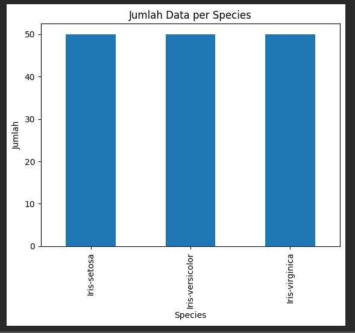
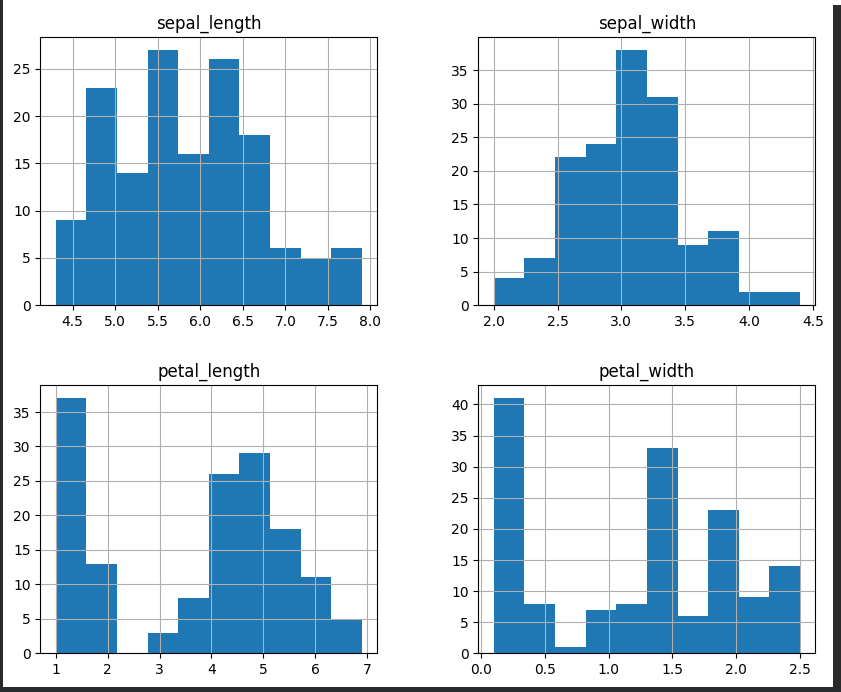
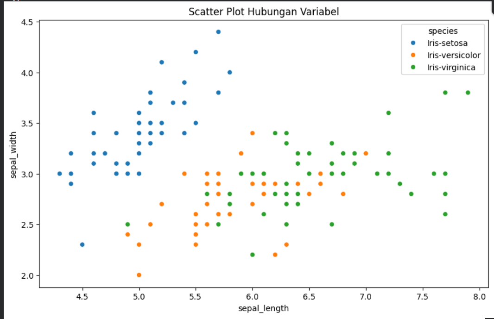
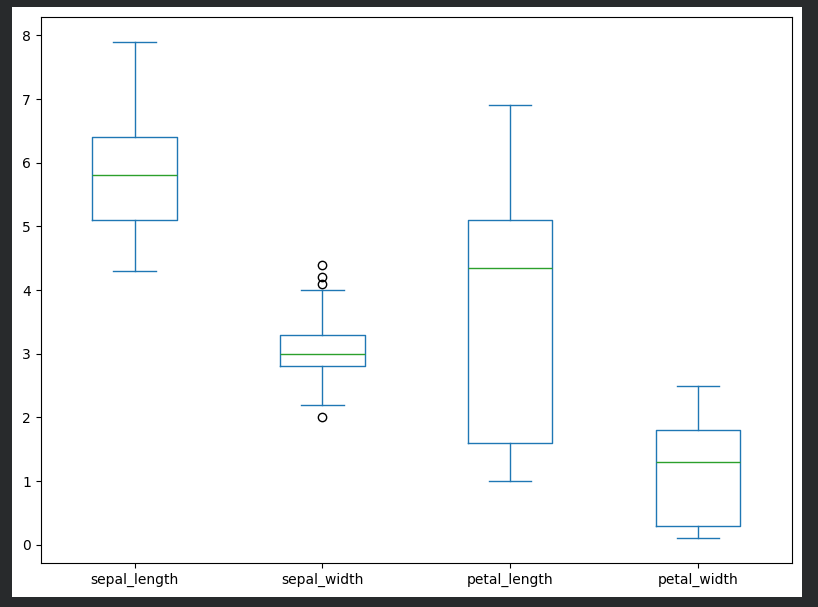
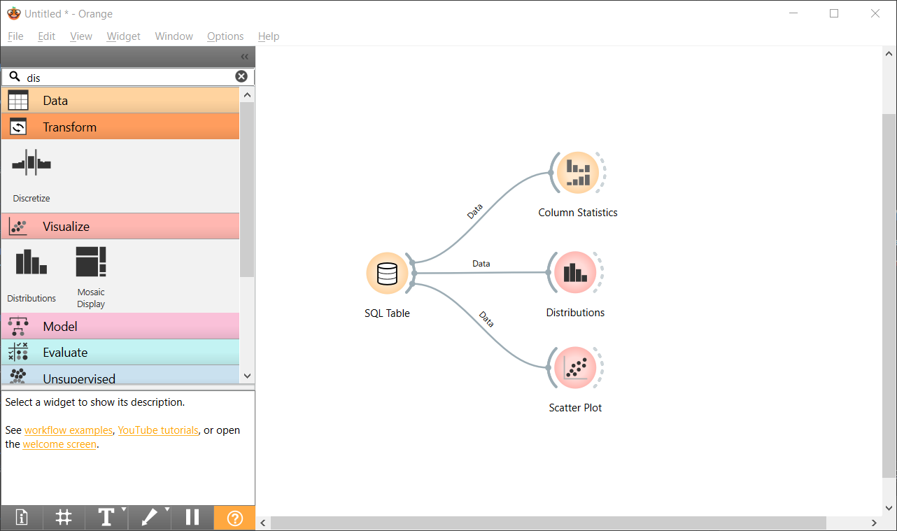
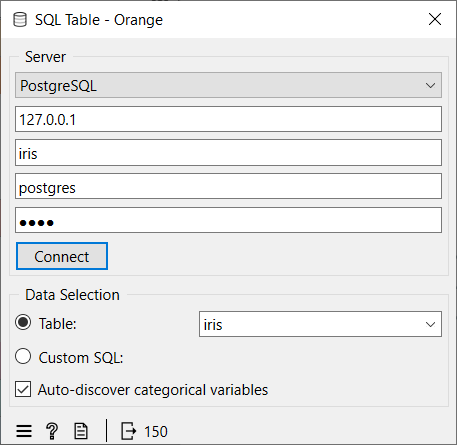
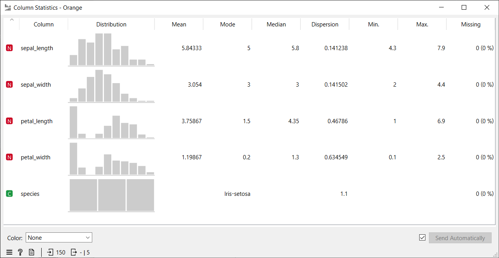
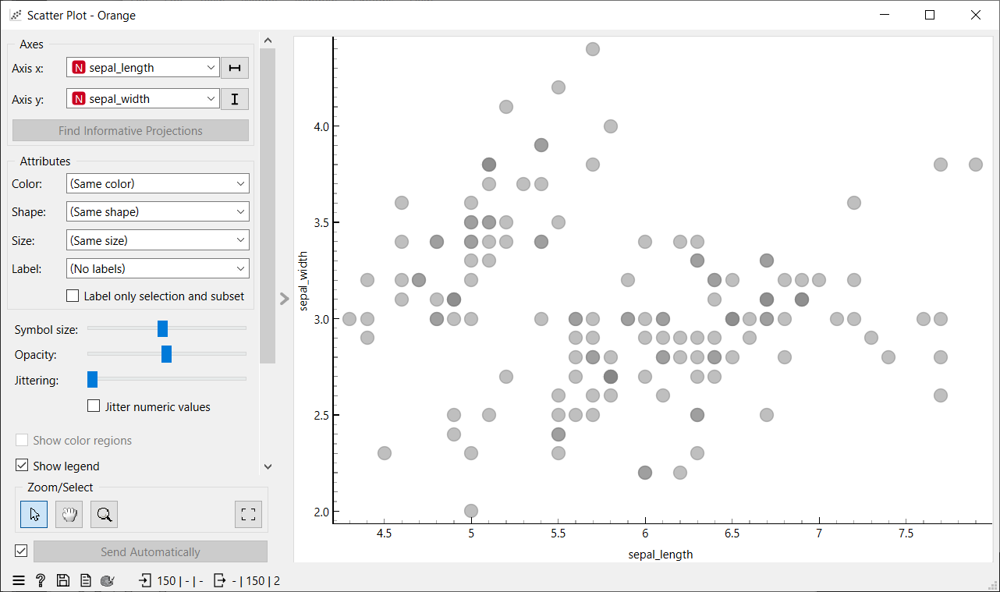
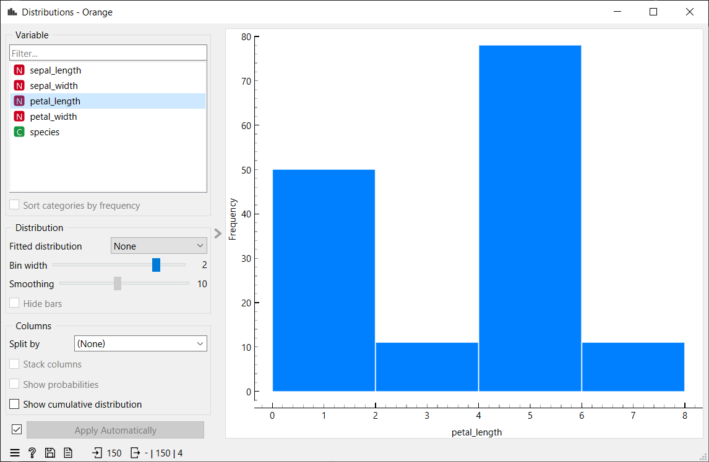
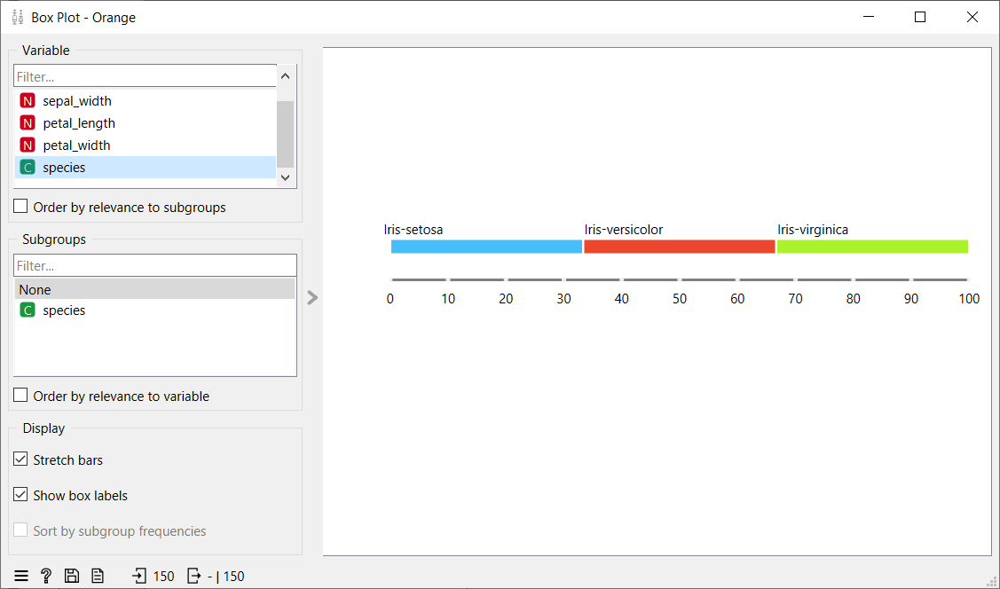

# Data Understanding

Data Understanding adalah tahap awal untuk melakukan pengukuran dan pemahaman terhadap data. Proses ini melibatkan integrasi data dari berbagai format seperti XML, JSON, atau basis data lainnya. Setelah data terkumpul, langkah krusial berikutnya adalah membersihkan data untuk menjaga kualitas analisis.

### Kualitas dan Kebersihan Data

Data yang kotor dapat menghambat proses penambangan data. Beberapa jenis data kotor yang sering ditemui antara lain:
1. Redudansi data: Kondisi di mana terdapat data yang berulang atau duplikat dalam dataset.
2. Data tidak konsisten: Kondisi di mana data memiliki format atau nilai yang berbeda untuk informasi yang sama.

Kualitas data dapat dinilai dari ada tidaknya nilai yang hilang (missing values) dan data duplikat. Missing values dapat ditoleransi jika jumlahnya kurang dari 10 persen dari total data.

### Komponen Utama Memahami Data

Terdapat empat komponen utama dalam memahami data:
1. Penumpukan data awal: Proses pengumpulan data mentah dari berbagai sumber.
2. Deskripsi data: Memberikan gambaran umum mengenai karakteristik data yang dimiliki.
3. Eksplorasi data: Melakukan pencarian pola atau hubungan awal antar variabel melalui analisis statistik atau visualisasi.
4. Kualitas data: Memastikan data sudah layak dan bersih untuk diproses lebih lanjut.

### Struktur Data dan Seleksi Fitur

Data tabular memiliki struktur yang terdiri dari baris dan kolom. Dalam proses analisis, dilakukan seleksi fitur untuk mengurangi jumlah kolom atau variabel yang tidak relevan. Semua variabel yang ada perlu diseleksi untuk memastikan model yang dibangun efektif.

Dalam penulisan ilmiah atau skripsi, jumlah data harus dinyatakan secara pasti dan tegas. Penggunaan kata "kira-kira" harus dihindari untuk menjaga validitas informasi.

### Teknik Analisis dan Pemodelan

Dalam data understanding, dilakukan Eksplorasi Data Analisis (EDA) untuk melihat hubungan antar variabel. Beberapa teknik yang digunakan antara lain:
1. Regresi Linier: Pendekatan rumus dengan melihat pola kumpulan data yang membentuk garis lurus.
2. Regresi Non Linier: Pendekatan di mana pola data tidak lurus melainkan memiliki bentuk yang berbelok-belok.
3. Scatter Plot: Digunakan untuk melihat persebaran data dan korelasi antar variabel.
4. Histogram: Digunakan untuk melihat distribusi frekuensi dari data.
5. Outlier: Deteksi terhadap data yang memiliki nilai sangat jauh berbeda dari kumpulan data lainnya.

### Sumber dan Tipe Data

Data dapat diperoleh dari berbagai sumber seperti database perusahaan, media sosial, rekaman log sistem, atau hasil survei. Tipe data yang umum ditemui meliputi:
1. Biner: Terdiri dari biner simetris (tidak ada penekanan pada salah satu kategori, contoh: jenis kelamin) dan biner asimetris (terdapat penekanan pada salah satu kategori, contoh: hasil tes kesehatan).
2. Kategorikal: Data yang memiliki lebih dari tiga opsi kategori.
3. Numerik: Data yang merupakan hasil dari pengujian atau pengukuran angka secara langsung.

### Implementasi Google Colab

Berikut adalah kode lengkap untuk melakukan eksplorasi data secara menyeluruh di Google Colab:

```python
!pip install pandas seaborn matplotlib numpy
```
untuk menginstall ektensi pandas di google collab

```python
import pandas as pd
import seaborn as sns
import matplotlib.pyplot as plt
import numpy as np
from google.colab import files
```
menampilkan library pandas

```python
print("Silakan pilih file CSV kamu:")
uploaded = files.upload()
file_path = list(uploaded.keys())[0]
df = pd.read_csv(file_path)
```
code untuk menambahkan file csv ke google collab

**Tabel head:**

```python
print("\n=== STRUKTUR DATA ===")
display(df.head())
```
**Hasil Output (Tabel head):**

| index | sepal_length | sepal_width | petal_length | petal_width | species |
| :-- | :-- | :-- | :-- | :-- | :-- |
| 0 | 5.1 | 3.5 | 1.4 | 0.2 | Iris-setosa |
| 1 | 4.9 | 3.0 | 1.4 | 0.2 | Iris-setosa |
| 2 | 4.7 | 3.2 | 1.3 | 0.2 | Iris-setosa |
| 3 | 4.6 | 3.1 | 1.5 | 0.2 | Iris-setosa |
| 4 | 5.0 | 3.6 | 1.4 | 0.2 | Iris-setosa |

**Pengecekan Jumlah Dataset**

```pyhton
df.shape
```

**Hasil Pengecekan Dataset**

|150|5|

**Informasi Dataset**

```python
df.info()
```
Hasil menunjukkan dataset terdiri dari 150 baris dan 5 kolom.

**Informasi Dataset :**

<class 'pandas.DataFrame'>
RangeIndex: 150 entries, 0 to 149
Data columns (total 5 columns):
| # | |Column      |   |Non-Null Count | |Dtype  |
|---| |------      |   |-------------- | |-----  |
| 0 | |sepal_length|   |150 non-null   | |float64|
| 1 | |sepal_width |   |150 non-null   | |float64|
| 2 | |petal_length|   |150 non-null   | |float64|
| 3 | |petal_width |   |150 non-null   | |float64|
| 4 | |species     |   |150 non-null   | |str    |
dtypes: float64(4), str(1)
memory usage: 6.0 KB

Dari hasil di atas dapat disimpulkan:

*Empat kolom bertipe float (numerik).<br>
*Satu kolom bertipe object (kategori).<br>
*Tidak terdapat nilai null pada seluruh kolom.<br>

**Tabel Statistik Deskriptif:**

```python
print("\n=== STATISTIK DESKRIPTIF ===")
display(df.describe())
```

**Hasil Output (Tabel Statistik Deskriptif):**

| | sepal_length | sepal_width | petal_length | petal_width |
| :-- | :-- | :-- | :-- | :-- |
| **count** | 150.000000 | 150.000000 | 150.000000 | 150.000000 |
| **mean** | 5.843333 | 3.054000 | 3.758667 | 1.198667 |
| **std** | 0.828066 | 0.433594 | 1.764420 | 0.763161 |
| **min** | 4.300000 | 2.000000 | 1.000000 | 0.100000 |
| **25%** | 5.100000 | 2.800000 | 1.600000 | 0.300000 |
| **50%** | 5.800000 | 3.000000 | 4.350000 | 1.300000 |
| **75%** | 6.400000 | 3.300000 | 5.100000 | 1.800000 |
| **max** | 7.900000 | 4.400000 | 6.900000 | 2.500000 |

**ANALISIS KUALITAS DATA**

**Mencari Data Duplikat:**

```python
print("\n=== ANALISIS KUALITAS DATA ===")
print(f"Data Duplikat: {df.duplicated().sum()}")
```

**Data Duplikat:** 3

**Mencari Data Missing Value:**

```python
print("\nMissing Values:")
print(df.isnull().sum())
```

**Hasil Output Missing Value:**

| Atribut | Jumlah Missing Value |
| :-- | :-- |
| sepal_length | 0 |
| sepal_width | 0 |
| petal_length | 0 |
| petal_width | 0 |
| species | 0 |

**Visualisasi Google Colab:**

**- Distribusi Jumlah Data Per Species (Colab):**

```python
df['species'].value_counts().plot(kind='bar')
plt.title("Jumlah Data per Species")
plt.xlabel("Species")
plt.ylabel("Jumlah")
plt.show()
```



**- Statistik Deskriptif (Colab):**

```python
plt.figure(figsize=(10, 6))
sns.scatterplot(data=df, x=df.columns[0], y=df.columns[1], hue=df.columns[-1])
plt.title('Scatter Plot Hubungan Variabel')
plt.show()
```



**- Scatter Plot (Colab):**

```python
df.hist(figsize=(10, 8))
plt.show()
```



**- Box Plot untuk deteksi outlier (Colab):**

```python
df.plot(kind='box', figsize=(8,6))
plt.tight_layout()
plt.show()
```



### Analisis Pengukuran Jarak (Distance Matrix)
Dalam tahap Pemahaman Data ini, saya berusaha menganalisis hubungan antar data melalui pengukuran jarak. Tujuannya adalah untuk menentukan apakah data yang berada dalam kelas yang sama benar-benar terletak berdekatan dan apakah terdapat jarak yang cukup antara kelas-kelas yang berbeda.

Dengan pendekatan ini, struktur dataset dapat dipahami dengan lebih mendalam sebelum melanjutkan ke tahap Modeling.

1. Euclidean Distance

Metode yang digunakan pertama kali adalah Jarak Euclidean.

Jarak Euclidean adalah panjang garis langsung yang menghubungkan dua titik di dalam ruang dengan banyak dimensi. Dalam dataset Iris, jarak dihitung dengan mempertimbangkan empat fitur numerik:

*sepal_length

*sepal_width

*petal_length

*petal_width

Nilai jarak yang lebih kecil menunjukkan bahwa dua data semakin serupa. Sebaliknya, nilai jarak yang lebih tinggi menunjukkan perbedaan yang lebih besar.

```python
import pandas as pd
from sklearn.metrics import pairwise_distances

# Membaca dataset
df = pd.read_csv("IRIS.csv")

# Mengambil fitur numerik saja
X = df.drop("species", axis=1)

# Menghitung distance matrix Euclidean
euclidean_matrix = pairwise_distances(X, metric="euclidean")

euclidean_matrix[:5, :5]
```
**- Hasil Output Ecludian Matrix :**

```python
array([[0.        , 0.53851648, 0.50990195, 0.64807407, 0.14142136],
       [0.53851648, 0.        , 0.3       , 0.33166248, 0.60827625],
       [0.50990195, 0.3       , 0.        , 0.24494897, 0.50990195],
       [0.64807407, 0.33166248, 0.24494897, 0.        , 0.64807407],
       [0.14142136, 0.60827625, 0.50990195, 0.64807407, 0.        ]])
```

Dari analisis matriks jarak di atas, dapat disimpulkan bahwa:

*Angka pada diagonal selalu nol, karena jarak antara suatu data dan dirinya sendiri adalah nol.<br>
*Data yang termasuk dalam kategori yang sama biasanya memiliki jarak yang dekat.<br>
*Jarak antara spesies Setosa dan Virginica terbilang lebih besar dibandingkan jarak antar spesies dalam kategori yang sama.<br>

2. Mahalanobis Distance

Selain Euclidean, saya juga mengeksplorasi Jarak Mahalanobis.

Perbedaannya terletak pada fakta bahwa Mahalanobis memperhitungkan:

*Variansi dari setiap fitur<br>
*Korelasi antar fitur<br>

Ini berarti bahwa jika terdapat dua fitur yang saling berhubungan, metode ini tidak akan menganggap mereka sebagai dua informasi yang sepenuhnya terpisah.

```python
import numpy as np
from scipy.spatial.distance import mahalanobis

# Menghitung matriks kovarians dan inversnya
cov_matrix = np.cov(X.values.T)
inv_cov_matrix = np.linalg.inv(cov_matrix)

# Fungsi untuk menghitung Mahalanobis Distance
def mahalanobis_distance(u, v):
    return mahalanobis(u, v, inv_cov_matrix)

# Menghitung distance matrix Mahalanobis
mahalanobis_matrix = pairwise_distances(X, metric=mahalanobis_distance)

mahalanobis_matrix[:5, :5]
```

**- Hasil Output Mahalanobis Distance :**

```python
array([[0.        , 1.35971517, 0.96949963, 1.4051749 , 0.59237982],
       [1.35971517, 0.        , 0.97318639, 1.45780085, 1.81903532],
       [0.96949963, 0.97318639, 0.        , 0.7175178 , 1.12917957],
       [1.4051749 , 1.45780085, 0.7175178 , 0.        , 1.32978712],
       [0.59237982, 1.81903532, 1.12917957, 1.32978712, 0.        ]])
```

3. Kesimpulan Pengukuran Jarak

Berdasarkan penilaian jarak yang telah dilakukan:

*Informasi dalam kategori yang sama biasanya saling dekat.<br>
*Setosa menjadi kategori yang paling berbeda dibandingkan dua kategori lainnya.<br>
*Variabel petal_length dan petal_width memberikan dampak signifikan terhadap perbedaan jarak.<br>
*Dataset Iris menunjukkan struktur yang relatif jelas untuk proses pengklasifikasian.<br>

Langkah ini masih tergolong dalam Pemahaman Data karena bertujuan untuk mengerti pola dan hubungan antar data sebelum dilakukan pemodelan.

### Implementasi Menggunakan Orange Data Mining

Selain melalui kode, eksplorasi data juga dapat dilakukan dengan Orange Data Mining menggunakan sistem tarik-lepas (*drag and drop*) widget.

**Flow Orange:**


Langkah-langkah di Orange:
1.  **File**: Digunakan untuk mengimpor file CSV atau database lokal.
2.  **Data Table**: Untuk memverifikasi jumlah baris, kolom, dan isi data.
3.  **Distributions**: Untuk melihat grafik batang dan distribusi frekuensi data.
4.  **Scatter Plot**: Untuk mendeteksi tren dan pengelompokan spesies secara visual.
5.  **Box Plot**: Untuk memantau rentang nilai dan mendeteksi pencilan (*outlier*).

**Visualisasi Orange Data Mining:**

**1. Impor Data:**



**2. Statistik Kolom:**


**3. Distribusi Fitur:**


**4. Scatter Plot:**


**5. Box Plot:**
