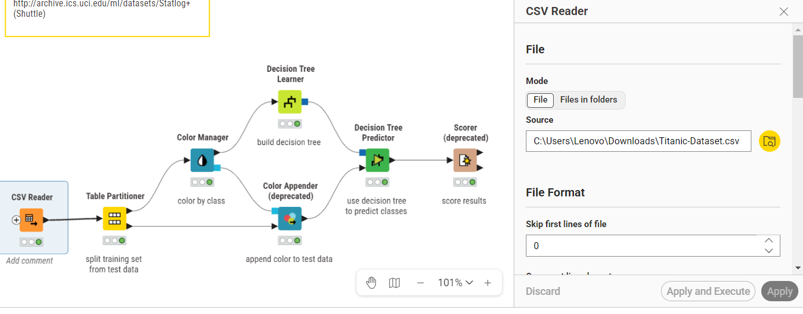
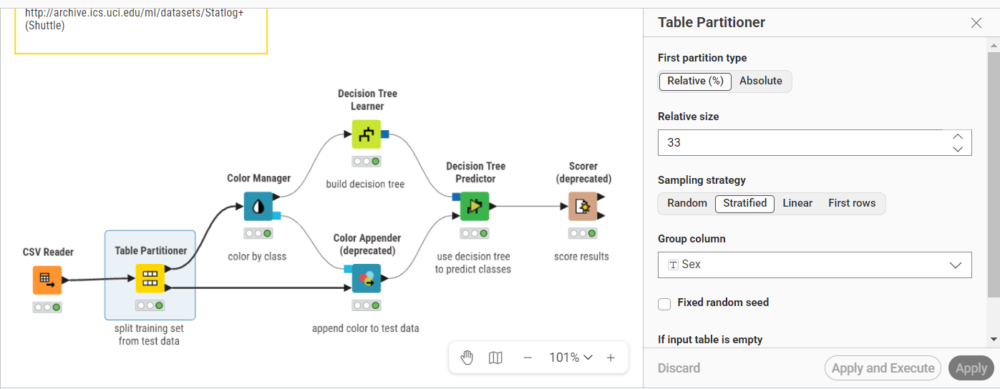
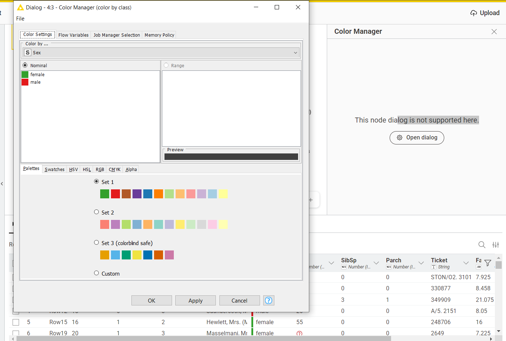
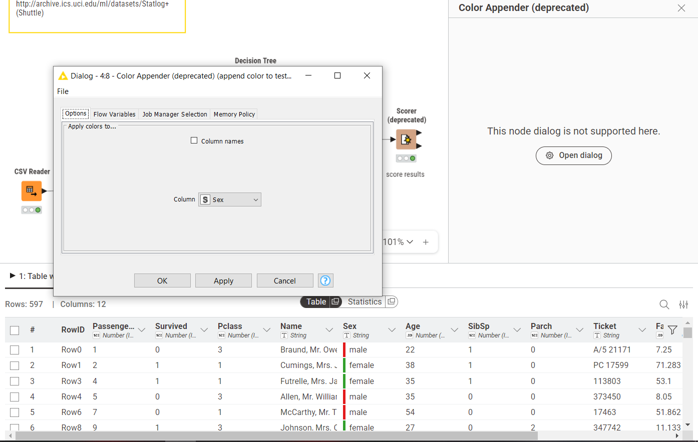
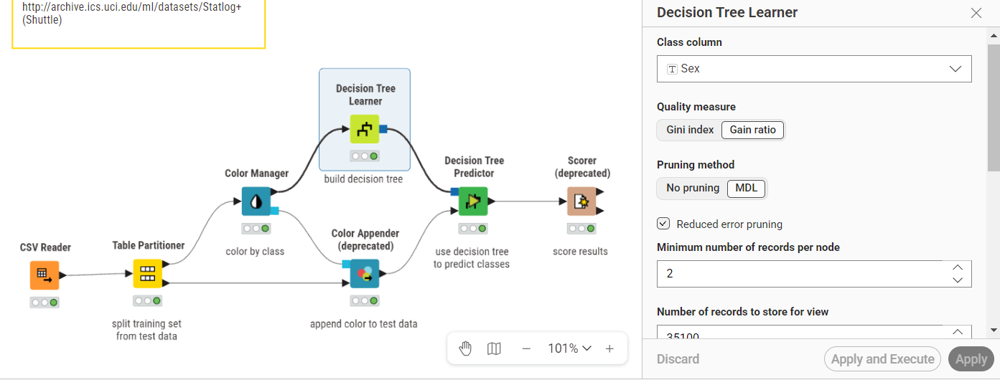
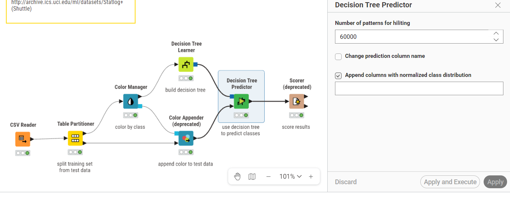
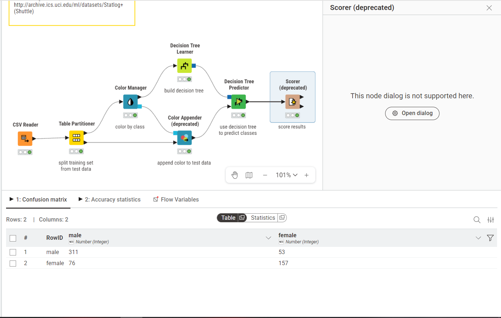

### 1.DECISION THREE
Decision Tree adalah metode pembelajaran mesin supervised yang membangun model berupa struktur tree hierarkis untuk melakukan klasifikasi atau regresi. Setiap internal node merepresentasikan sebuah pengujian terhadap suatu atribut (fitur), setiap branch merepresentasikan hasil pengujian tersebut, dan setiap leaf node merepresentasikan label kelas akhir yang menjadi output prediksi.

Secara konseptual, Decision Tree bekerja seperti serangkaian pertanyaan yes/no yang diajukan secara berurutan terhadap data baru hingga sampai pada suatu kesimpulan.

### 2. IMPLEMENTASI KNIME
## 2.1 Csv Reader
Node Table Reader digunakan untuk membaca file Titanic.csv dari direktori lokal.

## 2.2 Table Partioner
Node Table Partitioner membagi dataset menjadi dua partisi: training set dan test set. Konfigurasi yang digunakan:

*Ukuran partisi pertama (training set): 67% dari total data (test set 33%)

*Strategi sampling: Stratified Sampling dengan group column Sex, untuk memastikan distribusi kelas pada training set dan test set proporsional

## 2.3 Color Manager
Node Color Manager memberikan warna pada nilai-nilai kelas target untuk memudahkan visualisasi pada node-node berikutnya, termasuk tampilan Decision Tree. Konfigurasi warna yang digunakan:

Sex = male: warna merah

Sex = female : warna hijau

Pemberian warna ini bersifat kosmetik dan tidak memengaruhi proses training model, tetapi sangat membantu dalam menginterpretasikan visualisasi Decision Tree secara intuitif.

## 2.4 Color Appender (deprecated)
Node Color Appender (deprecated) meneruskan informasi warna dari Color Manager ke test set sehingga warna kelas turut ditampilkan pada output Decision Tree Predictor. Node ini diaplikasikan pada kolom Sex di test set (output kedua Table Partitioner).

## 2.5 Decision Tree Learner
Node Decision Tree Learner merupakan inti dari workflow ini. Node ini membangun model Decision Tree dari training set

Parameter Quality measure diatur ke Gain Ratio sehingga pemilihan atribut pada setiap node menggunakan rumus Gain Ratio. Parameter Pruning method MDL membuang branch yang tidak signifikan untuk mengurangi overfitting. Minimum number of records per node sebesar 2 memastikan setiap leaf node minimal memiliki 2 sampel.

## 2.6 Decision Tree Predictor
Node Decision Tree Predictor menggunakan model yang sudah dibangun oleh Decision Tree Learner untuk memprediksi kelas pada test set. Konfigurasi yang digunakan:

Number of patterns for hiliting: 60000 (jumlah pola maksimum yang dapat di-highlight pada tampilan tree)

Node ini menghasilkan kolom tambahan berisi prediksi kelas (Prediction (Sex)) yang akan dibandingkan dengan nilai aktual pada tahap evaluasi.

## 2.7 Scorer (deprecated)
Node Scorer (deprecated) membandingkan kolom aktual dan kolom prediksi untuk menghasilkan confusion matrix dan metrik akurasi. Konfigurasi yang digunakan:

First column (nilai aktual): Sex

Second column (nilai prediksi): Prediction (Sex)

Sorting strategy: Insertion Order (urutan kelas mengikuti urutan kemunculan pertama di data)

Missing value handling: Ignore (baris dengan nilai kosong diabaikan)

Confusion matrix yang dihasilkan menunjukkan jumlah prediksi benar (True Positive dan True Negative) serta prediksi salah (False Positive dan False Negative) untuk masing-masing kelas.

### 3. Kelebihan dan Kekurangan Decision Tree
Kelebihan:

1. Mudah diinterpretasikan karena struktur tree dapat divisualisasikan dan dipahami secara intuitif tanpa keahlian statistik mendalam.

2. Dapat menangani fitur kategorik maupun numerik tanpa memerlukan normalisasi atau transformasi data terlebih dahulu.

3. Tidak memerlukan asumsi distribusi data, berbeda dengan metode seperti Naive Bayes yang mengasumsikan distribusi Gaussian untuk fitur numerik.

4. Feature selection terjadi secara otomatis selama pembangunan tree berdasarkan Gain Ratio, sehingga fitur yang tidak relevan cenderung tidak digunakan.

Kekurangan:

1. Rentan terhadap overfitting jika tree dibiarkan tumbuh penuh tanpa pruning, terutama pada dataset dengan banyak fitur.

2. Tidak stabil: perubahan kecil pada training set dapat menghasilkan struktur tree yang sangat berbeda.

3. Kurang optimal untuk dataset dengan hubungan fitur yang bersifat linear atau kontinu, dibandingkan metode seperti regresi logistik.

4. Gain Ratio dapat mengalami kesulitan ketika semua atribut memiliki nilai informasi yang sangat rendah atau seragam.

