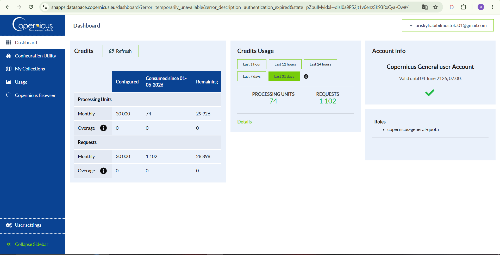
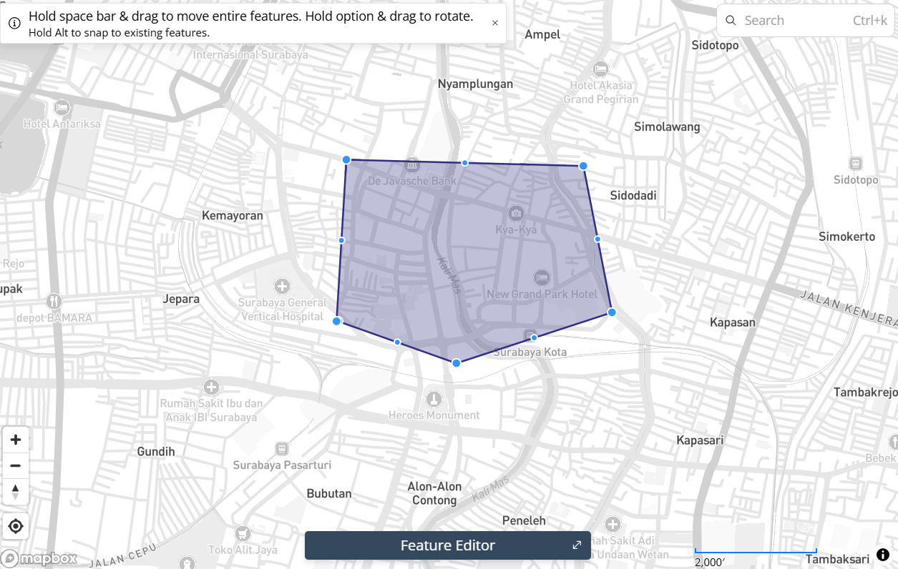
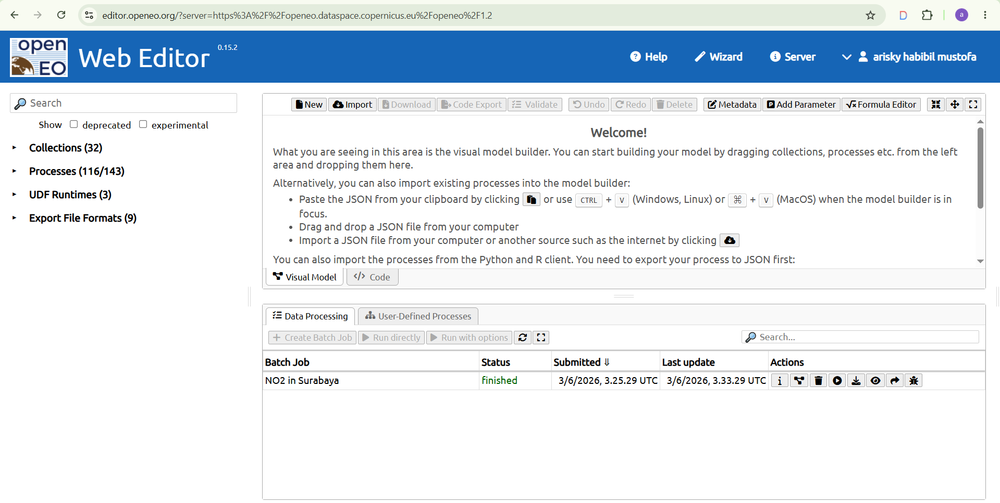
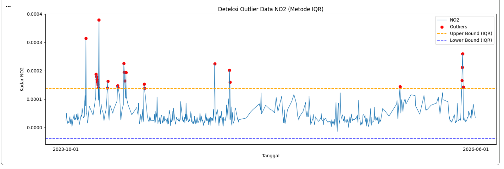
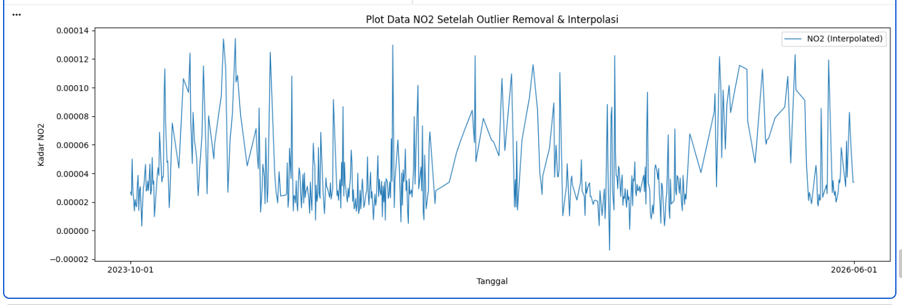
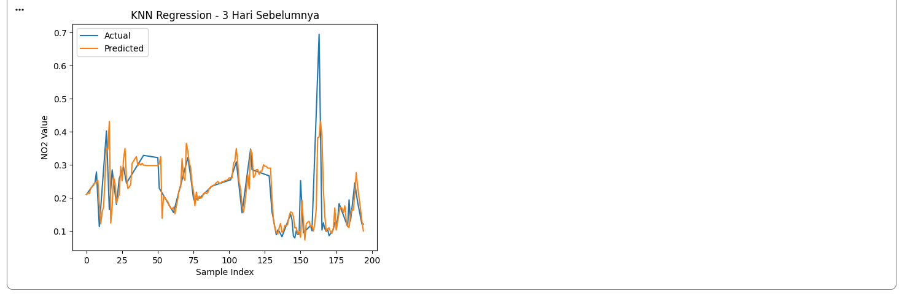
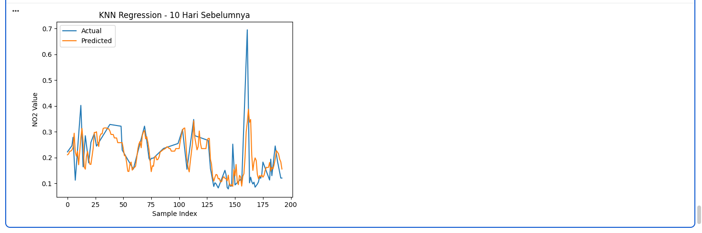

## Peramalan kadar di daerah Surabaya
### Latar Belakang
Peningkatan aktivitas industri, transportasi, serta pertumbuhan populasi yang pesat telah menyebabkan peningkatan signifikan terhadap tingkat pencemaran udara di berbagai wilayah. Salah satu polutan udara utama yang menjadi perhatian adalah Nitrogen Dioksida (NO₂), yaitu gas beracun yang dihasilkan terutama dari proses pembakaran bahan bakar fosil seperti kendaraan bermotor, pembangkit listrik, dan kegiatan industri. NO₂ memiliki dampak serius terhadap kesehatan manusia, seperti gangguan pernapasan, iritasi paru-paru, serta memperburuk penyakit asma dan bronkitis. Selain itu, NO₂ juga berkontribusi terhadap pembentukan hujan asam dan penurunan kualitas lingkungan secara keseluruhan.

### 1. Pengumpulan Data
Pertama kita akan mengumpulkan data Time Series Harian kadar NO2 di daerah Surabaya. Pengumpulan data dari sumber website https://dataspace.copernicus.eu/ buat akun terlebih dahulu di website copernicus tersebut.

Disini kita akan mengambil data kadar NO2 di daerah Surabaya dari tanggal … sampai … .

Kita install terlebih dahulu openoneo:
```python
pip install openeo
```
Lalu tuliskan code dibawah:
```pyhton
import openeo
connection = openeo.connect("openeo.dataspace.copernicus.eu").authenticate_oidc()
```
pada saat menjalankan baris code diatas (connection), nanti akan diminta authentikasi seperti output berikut:
```python
Terminal/Output
Visit (link authentikasi) 📋 to authenticate.
✅ Authorized successfully
Authenticated using device code flow.
```
Kalian tinggal klik link authentikasi lalu login menggunakan akun “copernicus” kalian.
```python
aoi = {
    "type": "Polygon",
    "coordinates": [
[
            [ 112.7362546,-7.2387995],
            [ 112.7437861,-7.2383832],
            [ 112.7457518,-7.2427872],
            [ 112.7409369,-7.2461833],
            [ 112.7358791,-7.2444085],
            [ 112.7358791,-7.2444085],
            [ 112.7362546,-7.2387995]
          ]
    ]
}

s5post = connection.load_collection(
    "SENTINEL_5P_L2",
    temporal_extent=["2023-10-01", "2026-06-01"],
    spatial_extent={
        "west": 112.7358791,
        "south": -7.2461833,
        "east": 112.7457518,
        "north": -7.2383832
    },
    bands=["NO2"],
)

# Now aggregate by day to avoid having multiple data per day
s5p_no2_daily = s5post.aggregate_temporal_period(reducer="mean", period="day")

# Now create a spatial aggregation to generate mean timeseries data
s5p_no2_aoi = s5p_no2_daily.aggregate_spatial(reducer="mean", geometries=aoi)
```
Code diatas memerlukan titik koordinasi area yang akan diambil data 
-nya, untuk mengambil titik koordinasi kaian kunjungi webiste https://geojson.io/#map=14.8/-7.04732/112.69463 . Didalam website tersebut kalian akan memilih daerah dengan cara memberi shape kotak didaerah yang ingin kalian ambil datanya.

Di panel sebelah kanan terdapat data JSON yang berupa koordinat daerah yang kalian pilih, kalian salin terus sesuaikan dengan code diatas di bagian variabel “aoi” dan spatial_extent.
Lalu kalian tambahkan baris code dibawah untuk memulai pengambilan data:
```python
job = s5post.execute_batch(title="NO2 in Surabaya", outputfile="NO2Surabaya.nc")
```
Tunggu proses pengambilan data, output proses seperti berikut:
```python
0:00:00 Job 'j-2606030325294873b2aa515ffbf885c8': send 'start'
0:00:11 Job 'j-2606030325294873b2aa515ffbf885c8': queued (progress 0%)
0:00:16 Job 'j-2606030325294873b2aa515ffbf885c8': queued (progress 0%)
0:00:23 Job 'j-2606030325294873b2aa515ffbf885c8': queued (progress 0%)
0:00:31 Job 'j-2606030325294873b2aa515ffbf885c8': queued (progress 0%)
0:00:41 Job 'j-2606030325294873b2aa515ffbf885c8': queued (progress 0%)
0:00:53 Job 'j-2606030325294873b2aa515ffbf885c8': running (progress N/A)
0:01:09 Job 'j-2606030325294873b2aa515ffbf885c8': running (progress N/A)
0:01:28 Job 'j-2606030325294873b2aa515ffbf885c8': running (progress N/A)
0:01:52 Job 'j-2606030325294873b2aa515ffbf885c8': running (progress N/A)
0:02:22 Job 'j-2606030325294873b2aa515ffbf885c8': running (progress N/A)
0:02:59 Job 'j-2606030325294873b2aa515ffbf885c8': running (progress N/A)
0:03:46 Job 'j-2606030325294873b2aa515ffbf885c8': running (progress N/A)
0:04:45 Job 'j-2606030325294873b2aa515ffbf885c8': running (progress N/A)
0:05:45 Job 'j-2606030325294873b2aa515ffbf885c8': running (progress N/A)
0:06:45 Job 'j-2606030325294873b2aa515ffbf885c8': running (progress N/A)
0:07:45 Job 'j-2606030325294873b2aa515ffbf885c8': running (progress N/A)
0:08:46 Job 'j-2606030325294873b2aa515ffbf885c8': finished (progress 100%)
```
Abaikan ketika ada N/A.

Ketika proses pengambilan data, aktivitas kalian akan terekam di halaman https://editor.openeo.org/?server=https%3A%2F%2Fopeneo.dataspace.copernicus.eu%2Fopeneo%2F1.2. Disitu terdapat nama dataset dan status pengambilan data.

### 2. Preproccessing Data
Setelah kita mengambil data, data bisa diunduh di halaman https://editor.openeo.org/?server=https%3A%2F%2Fopeneo.dataspace.copernicus.eu%2Fopeneo%2F1.2. File akan berbentuk .nc. Kita cuman perlu kolom date dan NO2 menggunakan code dibawah:
```python
!pip install netCDF4
import netCDF4

file_path = "NO2Surabaya.nc"
ds = netCDF4.Dataset(file_path)

# Lihat seluruh variabel yang tersedia
print("📦 Variabel dalam file:")
print(ds.variables.keys())
# dict_keys(['t', 'x', 'y', 'crs', 'NO2'])

# Ambil NO2
no2 = ds.variables["NO2"][:]

# Ambil Time
time = ds.variables["t"][:]

# Konversi waktu ke format tanggal jika punya atribut 'units'
try:
    time_units = ds.variables["t"].units
    dates = netCDF4.num2date(time, units=time_units)
except Exception:
    dates = time  # fallback kalau tidak ada units

# Tampilkan struktur data NO2
print(type(no2))
# type <class 'numpy.ma.core.MaskedArray'>

print(len(no2))
# banyaknya data record NO2 725

print(len(no2[0]))
# panjang data perbaris 9

print(len(no2[0][0]))
# panjang perdata 8

print(no2[0][0][0])
# 3.7701793e-05
```
Dari code diatas kita mengetahui bentuk data dari kolom NO2 nya.
#### A. Mengatasi Missing Value menggunakan metode Interpolasi Linear
Sekarang kita akan mengatasi permasalahan missing value pada data NO2.
dengan code berikut:
```python
import numpy as np
import pandas as pd

# Interpolasi Linear
no2_filled = np.zeros_like(no2)
# Untuk jaga-jaga jika terdapat '--' tidak berubah menjadi 0
no2_filled = no2_filled.filled(0)

# loop tiap grid (y,x)
for i in range(no2.shape[1]):     # 9 baris
    for j in range(no2.shape[2]): # 8 kolom
        series = pd.Series(no2[:, i, j])
        no2_filled[:, i, j] = series.interpolate(method='linear', limit_direction='both').to_numpy()
```
Dengan code diatas, missing value yang terdapat pada data NO2 akan diisi secara otomatis menggunakan metode Interpolasi Linear.
#### B. Rata-rata kan Data dan ubah Datetime
Setelah mengatasi missing value, kita akan me-rata-rata-kan data NO2 agar satu record hanya berupa single value. Sekalian kita mengambil date nya dan menaruh di array. Kita akan mengubah datetime dari awalnya (2023-10-04 00:00:00) menjadi (2023-10-04) karena kita mengambil data time series harian jadi kita tidak memerlukan data jam, menit dan detik.
```python
new_dates = []
new_no2 = []
for i in range(len(dates)):
    # ubah format datetime
    new_date = dates[i].strftime('%Y-%m-%d')
    new_dates.append(new_date)
    new_no2.append(np.mean(no2_filled[i]))
```
#### C. Simpan data dalam bentuk CSV
Setelah itu kita akan membentuk data menjadi DataFrame Pandas untuk disimpan menjadi CSV.
```python
df = pd.DataFrame({
    "date": new_dates,
    "NO2": new_no2
})

# Simpan ke CSV
df.to_csv("NO2_Surabaya_timeseries.csv", index=False)
```
#### D. Pengecekan Missing Value data harian pada CSV
Sekarang setelah data berbentuk CSV, kita cek apakah data Time Series harian lengkap. Cara men-cek apakah data Time Series Harian lengkap gunakan code dibawah:
```python
import pandas as pd
import numpy as np

df = pd.read_csv("NO2_Surabaya_timeseries.csv")

# Pastikan kolom 'date' bertipe datetime
df['date'] = pd.to_datetime(df['date'])

# Buat rentang tanggal lengkap
start_date = "2023-10-01"
end_date = "2026-06-01" # Updated end date
full_range = pd.date_range(start=start_date, end=end_date, freq='D')

# Cek tanggal yang hilang
missing_dates = full_range.difference(df['date'])

print(f"Jumlah hari missing: {len(missing_dates)}")
print("Daftar tanggal missing:")
print(missing_dates)
```
```python
Output :
Jumlah hari missing: 7
Daftar tanggal missing:
DatetimeIndex(['2023-11-11', '2024-01-01', '2024-03-23', '2024-08-12',
               '2025-01-30', '2025-01-31', '2026-06-01'],
              dtype='datetime64[ns]', freq=None)
```
Dalam kasus saya ini, terdapat 6 hari missing value. Kita akan mengatasi lagi missing value menggunakan metode Interpolasi Linear. Cara memperbaikinya gunakan code dibawah:
```python
import pandas as pd

# Pastikan datetime dan sorting
df['date'] = pd.to_datetime(df['date'])
df = df.sort_values('date')

# Buat rentang tanggal lengkap
full_range = pd.date_range(start="2023-10-01", end="2025-09-30", freq='D')

# Reindex agar tanggal yang hilang muncul sebagai NaN
df = df.set_index('date').reindex(full_range)
df.index.name = 'date'

# Interpolasi linear berdasarkan indeks waktu
df['NO2'] = df['NO2'].interpolate(method='time')

# (Opsional) jika masih ada NaN di bagian awal/akhir bisa gunakan forward/backward fill
df['NO2'] = df['NO2'].fillna(method='bfill').fillna(method='ffill')

# Simpan kembali ke CSV
df.to_csv("no2_timeseries_interpolated.csv")
```
Setelah saya cek missing value harian, sudah tidak ada lagi missing value.
```python
Output :
Jumlah hari missing: 0
Daftar tanggal missing:
DatetimeIndex([], dtype='datetime64[ns]', freq='D')
```

#### E. Deteksi Outlier IQR
Setelah kita mengisi missing value menggunakan metode Interpolasi Linear, selanjutnya kita akan mendeteksi Outlier menggunakan metode IQR.
```python
import pandas as pd
import numpy as np
import matplotlib.pyplot as plt

df = pd.read_csv("no2_timeseries_interpolated.csv")

df['date'] = pd.to_datetime(df['date'])

# Hitung IQR
Q1 = df['NO2'].quantile(0.25)
Q3 = df['NO2'].quantile(0.75)
IQR = Q3 - Q1

lower_bound = Q1 - 1.5 * IQR
upper_bound = Q3 + 1.5 * IQR

# Filter outlier
outliers_iqr = df[(df['NO2'] < lower_bound) | (df['NO2'] > upper_bound)]

print("Jumlah Outlier (IQR):", len(outliers_iqr))
print(outliers_iqr[['date', 'NO2']].head())
```
```python
Output :
Jumlah Outlier (IQR): 26
         date       NO2
48 2023-11-18  0.000315
72 2023-12-12  0.000188
73 2023-12-13  0.000179
74 2023-12-14  0.000170
75 2023-12-15  0.000160
```
Untuk men-visualisasi outlier:
```python
# === Visualisasi ===
plt.figure(figsize=(15,5))
plt.plot(df['date'], df['NO2'], label="NO2", linewidth=1)

# Titik Outlier
plt.scatter(outliers_iqr['date'], outliers_iqr['NO2'],
            color='red', marker='o', label="Outliers")

# Garis batas atas & bawah
plt.axhline(upper_bound, color='orange', linestyle='dashed', label="Upper Bound (IQR)")
plt.axhline(lower_bound, color='blue', linestyle='dashed', label="Lower Bound (IQR)")

plt.title("Deteksi Outlier Data NO2 (Metode IQR)")
plt.xlabel("Tanggal")
plt.ylabel("Kadar NO2")
plt.legend()
plt.tight_layout()
plt.xticks(
    ticks=[df['date'].iloc[0], df['date'].iloc[-1]],
    labels=[df['date'].iloc[0].strftime('%Y-%m-%d'),
            df['date'].iloc[-1].strftime('%Y-%m-%d')]
)
plt.show()
```

Setelah itu, kita akan menghapus data outlier. Karena data ini merupakan data Time Series, maka data outlier yang dihapus akan diisi kembali menggunakan Interpolasi Linear.
```python
# Tandai outlier menjadi NaN
df['NO2_cleaned'] = df['NO2'].mask((df['NO2'] < lower_bound) | (df['NO2'] > upper_bound))

print("Jumlah nilai yang dinyatakan sebagai outlier:", df['NO2_cleaned'].isna().sum())

# Interpolasi linear untuk mengisi kembali nilai outlier
df['NO2_filled'] = df['NO2_cleaned'].interpolate(method='linear')

# Jika masih tersisa NaN di ujung data, isi dengan forward/backward fill
df['NO2_filled'] = df['NO2_filled'].bfill().ffill()
# df['NO2_filled'] = df['NO2_filled'].fillna(method='bfill').fillna(method='ffill')

print("Jumlah missing setelah interpolasi:", df['NO2_filled'].isna().sum())
```
Visualisasi data setelah menghapus Outlier dan mengisi kembali menggunakan Interpolasi Linear:
```python
plt.figure(figsize=(15,5))
# Plot data hasil interpolasi
plt.plot(df['date'], df['NO2_filled'], label="NO2 (Interpolated)", linewidth=1)
# Tampilkan hanya tanggal awal dan akhir di sumbu X
plt.xticks(
    ticks=[df['date'].iloc[0], df['date'].iloc[-1]],
    labels=[df['date'].iloc[0].strftime('%Y-%m-%d'),
            df['date'].iloc[-1].strftime('%Y-%m-%d')]
)
plt.title("Plot Data NO2 Setelah Outlier Removal & Interpolasi")
plt.xlabel("Tanggal")
plt.ylabel("Kadar NO2")
plt.legend()
plt.tight_layout()
plt.show()
```

### 3. Modeling menggunakan KNN Regression
Dengan data Time Series kadar NO2 harian di daerah Surabya, kita akan memprediksi kadar NO2 satu hari yang akan datang. Sekarang kita akan ubah data, mencoba mencari korelasi antara 1 hari dengan 4 hari sebelumnya. Kita juga akan membandingkan apakah semakin banyak hari sebelumnya, model akan lebih bagus?
#### A. Uji Korelasi Data
Sebelum masuk ke modeling, data kita merupakan data unsupervised yang berarti tidak ada label. Kita ubah data menjadi supervised lalu uji korelasi terhadap label (t). Fitur-fitur nya merupakan 30 hari sebelum (t-30, t-29, … t-1) dan label (t).
```python
import pandas as pd
def create_supervised(data, n_lag=4):
    df_supervised = pd.DataFrame()

    # Membuat fitur t-4 sampai t-1
    for i in range(n_lag, 0, -1):
        df_supervised[f'NO2(t-{i})'] = data.shift(i)

    # Label hari H
    df_supervised['NO2(t)'] = data

    # Hapus baris yang masih mengandung NaN akibat shift
    df_supervised.dropna(inplace=True)

    return df_supervised

# contoh penggunaan
supervised_df30 = create_supervised(df['NO2_filled'], n_lag=30)

# Ambil semua lag dan kolom target
lag_cols = supervised_df30.drop(columns="NO2(t)").columns
correlations = supervised_df30[lag_cols].corrwith(supervised_df30['NO2(t)'])

# Tampilkan nilai korelasi
print(correlations)
```
```python
Output :
NO2(t-30)    0.366477
NO2(t-29)    0.402901
NO2(t-28)    0.419687
NO2(t-27)    0.420269
NO2(t-26)    0.407988
NO2(t-25)    0.401211
NO2(t-24)    0.387582
NO2(t-23)    0.388797
NO2(t-22)    0.396824
NO2(t-21)    0.405811
NO2(t-20)    0.406147
NO2(t-19)    0.396712
NO2(t-18)    0.393366
NO2(t-17)    0.396914
NO2(t-16)    0.389246
NO2(t-15)    0.381234
NO2(t-14)    0.383583
NO2(t-13)    0.388513
NO2(t-12)    0.413061
NO2(t-11)    0.445413
NO2(t-10)    0.463902
NO2(t-9)     0.469094
NO2(t-8)     0.453311
NO2(t-7)     0.475534
NO2(t-6)     0.520023
NO2(t-5)     0.551874
NO2(t-4)     0.586238
NO2(t-3)     0.636780
NO2(t-2)     0.717633
NO2(t-1)     0.832106
dtype: float64
```
Skala nilai uji korelasi itu dari -1 sampai 1, namun kita ambil nilai uji korelasi yang terbaik yaitu lebih dari 0.5 yaitu fitur t-1 sampai t-4.
#### B. Mengubah Data
Sekarang saya ingin mengubah data dari sebelumnya hanya 2 fitur  menjadi 3 hari sebelum yang terdapat 4 fitur (t-3, t-2, t-1, dan t sebagai label) karena dari uji korelasi, keempat fitur tersebut (t-1 sampai t-4) merupakan nilai uji korelasi terbaik (lebih dari 0.5). 
```pyhton
supervised_df = create_supervised(df['NO2_scaled'], n_lag=3)

print(supervised_df)
print(supervised_df.shape)

supervised_df.to_csv("no2_supervised_lag3.csv", index=True)
print("File 'no2_supervised_lag3.csv' berhasil disimpan!")
```
ketika sudah di running maka file akan menjadi csv
#### C. Modeling dan Evaluation
Sekarang dari 2 data yang sudah kita rubah, kita train menggunakan model KNN Regression.
```python
from sklearn.neighbors import KNeighborsRegressor
from sklearn.model_selection import train_test_split
from sklearn.metrics import mean_squared_error, r2_score
import numpy as np

def MAPE(y_true, y_pred):
    y_true, y_pred = np.array(y_true), np.array(y_pred)
    # Hindari pembagian dengan nol
    nonzero = y_true != 0
    return np.mean(np.abs((y_true[nonzero] - y_pred[nonzero]) / y_true[nonzero])) * 100

def train_knn(df_supervised, model_name=""):
    # Pisahkan fitur & label
    X = df_supervised.drop(columns=['NO2(t)']).values
    y = df_supervised['NO2(t)'].values

    # Split data 80/20
    X_train, X_test, y_train, y_test = train_test_split(
        X, y, test_size=0.2, shuffle=False
    )

    # Model KNN
    knn = KNeighborsRegressor(n_neighbors=5)
    knn.fit(X_train, y_train)

    # Prediksi
    y_pred = knn.predict(X_test)

    # Evaluasi
    mse = mean_squared_error(y_test, y_pred)
    rmse = np.sqrt(mse)
    r2 = r2_score(y_test, y_pred)
    mape = MAPE(y_test, y_pred)

    print(f"\n=== {model_name} ===")
    print(f"Train Size: {len(X_train)} — Test Size: {len(X_test)}")
    print(f"RMSE: {rmse:.6f}")
    print(f"R² Score: {r2:.4f}")
    print(f"MAPE: {mape:.4f}%")

    return knn, y_test, y_pred


# Train model untuk 4 hari sebelumnya
knn_3, y_test_3, y_pred_3 = train_knn(supervised_df, "KNN - 3 Hari Sebelumnya")

# Define supervised_df10 for training with 10 previous days
supervised_df10 = create_supervised(df['NO2_scaled'], n_lag=10)

# Train model untuk 10 hari sebelumnya
knn_10, y_test_10, y_pred_10 = train_knn(supervised_df10, "KNN - 10 Hari Sebelumnya")
```
```python
=== KNN - 3 Hari Sebelumnya ===
Train Size: 777 — Test Size: 195
RMSE: 0.058420
R² Score: 0.5531
MAPE: 15.0252%

=== KNN - 10 Hari Sebelumnya ===
Train Size: 772 — Test Size: 193
RMSE: 0.063152
R² Score: 0.4830
MAPE: 20.2684%
```
Berdasarkan hasil arkurasi diatas menjunjukkan bahwa lebih banyak hari sebelumnya maka model semakin bagus. 
#### E. Plotting
Plotting untuk visualisasi grafik antara label dan prediksi dari kedua data diatas.

4 hari sebelum:
```python
import matplotlib.pyplot as plt
import numpy as np

plt.figure()
plt.plot(np.arange(len(y_test_3)), y_test_3, label="Actual")
plt.plot(np.arange(len(y_pred_3)), y_pred_3, label="Predicted")
plt.title("KNN Regression - 3 Hari Sebelumnya")
plt.xlabel("Sample Index")
plt.ylabel("NO2 Value")
plt.legend()
plt.show()
```

10 hari sebelum:
```pyhton
plt.figure()
plt.plot(np.arange(len(y_test_10)), y_test_10, label="Actual")
plt.plot(np.arange(len(y_pred_10)), y_pred_10, label="Predicted")
plt.title("KNN Regression - 10 Hari Sebelumnya")
plt.xlabel("Sample Index")
plt.ylabel("NO2 Value")
plt.legend()
plt.show()
```

Hasil evaluasi model KNN Regression menunjukkan bahwa peningkatan jumlah fitur historis (lag) tidak serta merta meningkatkan performa prediksi. Pada model dengan 3 hari sebelumnya, nilai RMSE paling kecil dan R² masih positif sehingga model mampu menjelaskan sebagian kecil variabilitas data target. Namun, ketika jumlah lag ditambah menjadi 10  performa model justru menurun yang ditunjukkan oleh meningkatnya nilai RMSE dan MAPE, Nilai MAPE yang cukup tinggi pada seluruh model (lebih dari 60%) juga mengindikasikan bahwa akurasi prediksi masih rendah dan terdapat deviasi besar antara nilai prediksi dan nilai aktual. Secara keseluruhan, model KNN tidak memberikan performa yang baik pada data ini, dan penambahan fitur historis justru menyebabkan overfitting serta menurunkan kemampuan generalisasi model. Oleh karena itu, diperlukan pemilihan model lain atau peningkatan strategi preprocessing untuk memperoleh hasil prediksi yang lebih baik.