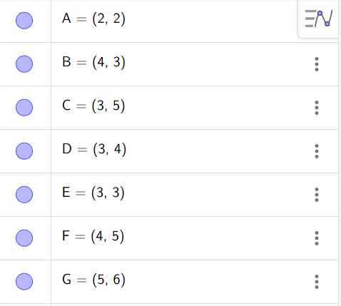
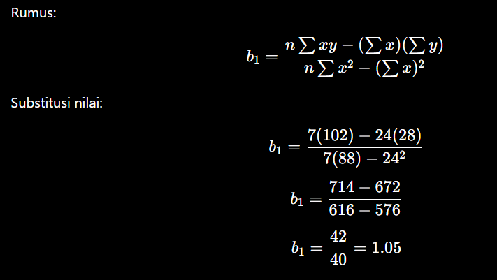
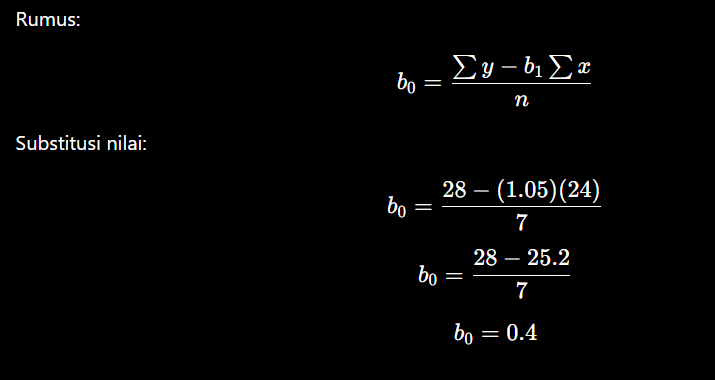
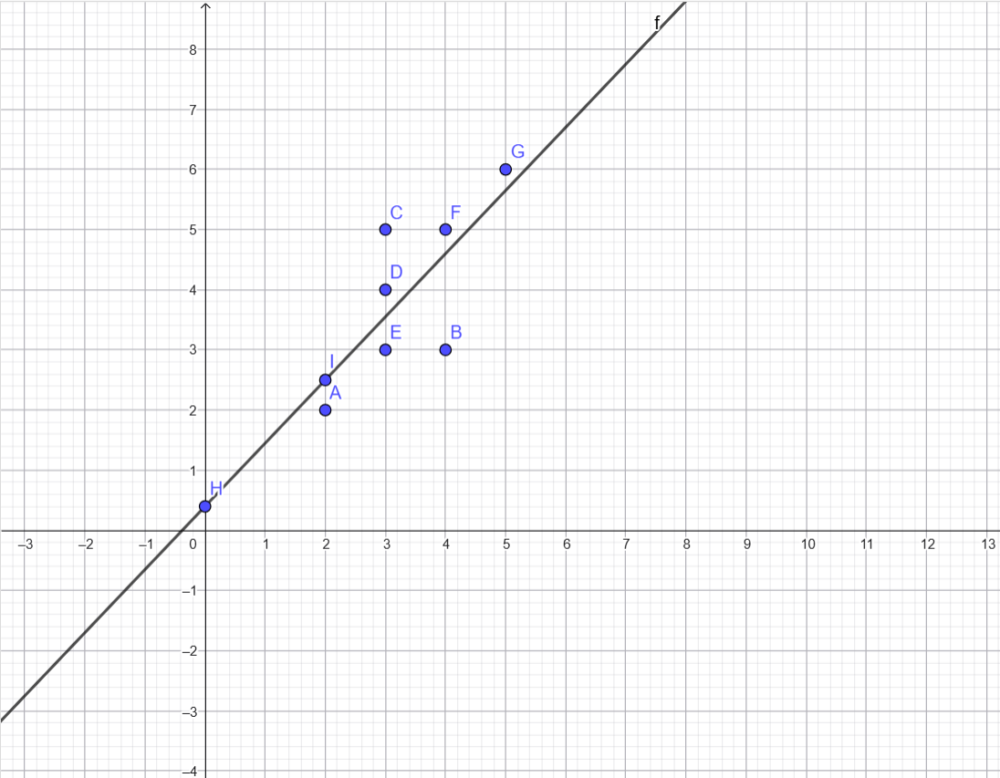
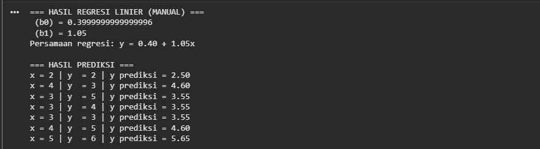
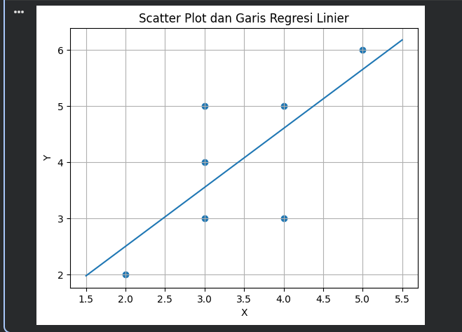

# Tugas Regresi Linier

## Data 


## Perhitungan Koefisien Regresi Linier
### 1. Menghitung b1


### 2 Menghitung b0


## Hasil dari GeoGebra


## Code :
```python
import numpy as np

# =========================
# DATA
# =========================
# Titik: A, B, C, D, E, F, G
x = np.array([2, 4, 3, 3, 3, 4, 5])
y = np.array([2, 3, 5, 4, 3, 5, 6])

n = len(x)

# =========================
# PERHITUNGAN MANUAL
# =========================
sum_x  = np.sum(x)
sum_y  = np.sum(y)
sum_x2 = np.sum(x**2)
sum_xy = np.sum(x*y)

# Rumus regresi linier
b1 = (n*sum_xy - sum_x*sum_y) / (n*sum_x2 - sum_x**2)
b0 = (sum_y - b1*sum_x) / n

print("=== HASIL REGRESI LINIER (MANUAL) ===")
print(f" (b0) = {b0}")
print(f" (b1) = {b1}")
print(f"Persamaan regresi: y = {b0:.2f} + {b1:.2f}x")

# =========================
# PREDIKSI NILAI Y
# =========================
y_pred = b0 + b1 * x

print("\n=== HASIL PREDIKSI ===")
for i in range(n):
    print(f"x = {x[i]} | y  = {y[i]} | y prediksi = {y_pred[i]:.2f}")

# =========================
# ERROR (OPSIONAL)
# =========================
mse = np.mean((y - y_pred)**2)
print("\nMean Squared Error (MSE) =", mse)
```
## Output :


## Code Scatter Plot :
```python
import numpy as np
import matplotlib.pyplot as plt

# =========================
# DATA
# =========================
x = np.array([2, 4, 3, 3, 3, 4, 5])
y = np.array([2, 3, 5, 4, 3, 5, 6])

# Koefisien regresi (hasil manual)
b0 = 0.4
b1 = 1.05

# =========================
# GARIS REGRESI
# =========================
x_line = np.linspace(min(x)-0.5, max(x)+0.5, 100)
y_line = b0 + b1 * x_line

# =========================
# SCATTER PLOT
# =========================
plt.figure()
plt.scatter(x, y)
plt.plot(x_line, y_line)

plt.xlabel("X")
plt.ylabel("Y")
plt.title("Scatter Plot dan Garis Regresi Linier")
plt.grid(True)

plt.show()
```

## Ouput :
