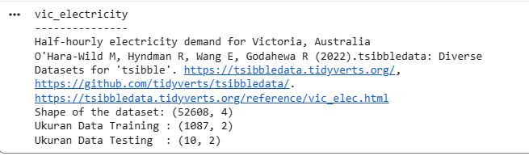
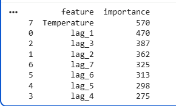
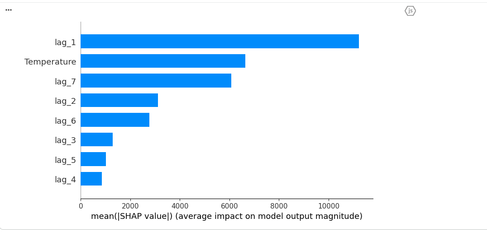
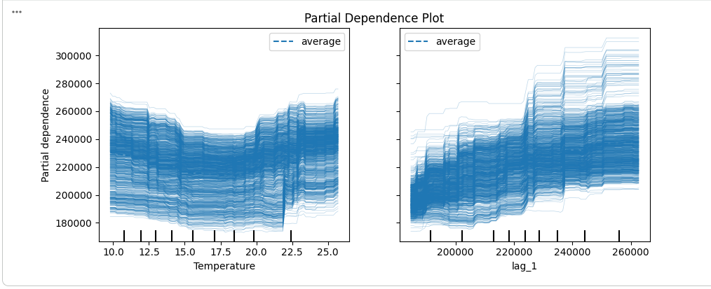

# Tugas: Reproduce & Analisis Skforecast Explainability (v0.15.1)
## 1. Analisa prediksi tentang apa?
Analisis yang dilakukan dalam dokumen ini berfokus pada peramalan total kebutuhan energi listrik harian di daerah Victoria, Australia.

Tujuan utama dari dokumen ini tidak sekadar melatih model untuk memprediksi angka di masa depan, tetapi juga menerapkan metode Pemahaman Model. Yang ingin dicapai adalah memahami model Machine Learning yang rumit, sehingga kita dapat secara jelas mengidentifikasi faktor-faktor apa saja (seperti suhu atau pola dari hari-hari sebelumnya) yang memberikan dampak terbesar terhadap fluktuasi hasil prediksi permintaan listrik.

## 2. Bagaimana bentuk data trainingnya ( apa saja inpunya dan apa outpunya)
Sebelum proses pelatihan, data deret waktu harian dikonversi oleh skforecast ke dalam format tabel (X dan y). Unsur-unsur yang ada di dalamnya adalah:

- Input (Fitur / Prediktor X):

    - Lags (lag_1 sampai lag_7): Data historis permintaan listrik dari sehari sebelumnya (t-1) sampai tujuh hari sebelumnya (t-7).

    - Variabel Eksternal: Rata-rata suhu udara harian (Temperature) pada hari yang akan diprediksi.

- Output (Target y):

    - Total nilai permintaan listrik pada hari itu (Demand pada waktu t).

## 3. Apa itu lag?
Dalam kajian mengenai deret waktu, Lag merupakan nilai masa lalu atau catatan data dari variabel utama pada waktu-waktu sebelumnya.

Untuk contoh data harian ini:

- Lag 1: Menggambarkan total permintaan listrik sehari sebelum tanggal yang ingin diprediksi.

- Lag 7: Menggambarkan total permintaan listrik tujuh hari sebelum tanggal yang akan diprediksi (tanggal yang sama pada minggu sebelumnya).

Lag berfungsi sebagai elemen penting karena umumnya karakteristik data deret waktu menunjukkan ketergantungan yang signifikan terhadap pola tren atau kebiasaan yang muncul pada periode sebelumnya.

## 4. Jelaskan proses analysis yang dilakukan dari kasus diatas
Alur proses analisis yang dilakukan dalam dokumen notebook ini mencakup langkah-langkah berikut:

1. Preprocessing dan Resampling Data: Mengambil dataset penggunaan listrik, menyaring informasi yang ada, dan mengubah frekuensinya dari per jam menjadi harian (resample('D')) dengan menjumlahkan total permintaan serta menghitung rata-rata temperatur. Setelah itu, data dibagi menjadi dua subset, yaitu data untuk pelatihan dan pengujian.

2. Pelatihan Model: Mengatur objek ForecasterRecursive yang menggunakan LGBMRegressor dengan mengatur parameter 7 lags dan 1 variabel eksogen, kemudian menjalankan proses . fit() pada set data pelatihan.

3. Mengekstraksi Pentingnya Fitur Global: Memanfaatkan fungsi . get_feature_importances() untuk menghitung kontribusi masing-masing fitur. Hasilnya menunjukkan bahwa variabel eksogen Temperatur memiliki nilai kepentingan yang tertinggi, diikuti oleh fitur lag_1.

4. Menghitung Nilai SHAP: Mengonversi data deret waktu menjadi matriks tabular standar melalui create_train_X_y(), kemudian menghitung kontribusi nilai SHAP dengan menggunakan TreeExplainer. Pada tahap ini, terdapat dua visualisasi yang dilakukan:
    - Global Interpretability (Ringkasan Grafik): Menganalisis seberapa besar pengaruh positif atau negatif dari nilai suatu fitur yang tinggi atau rendah terhadap hasil prediksi akhir.

5. Partial Dependence Plot (PDP): Memvisualisasikan grafik interaksi independen antara fitur (Temperatur dan lag_1) terhadap nilai prediksi target untuk memetakan hubungan non-linear yang dipelajari oleh model.

## Source Code
### 1. Import Library
```python
!pip install skforecast==0.15.1 shap lightgbm pandas numpy matplotlib scikit-learn
```
```python
import numpy as np
import pandas as pd
import matplotlib.pyplot as plt

# Model dan Forecasting
from lightgbm import LGBMRegressor
from skforecast.datasets import fetch_dataset
from skforecast.recursive import ForecasterRecursive

# Explainability & Metrics
import shap
from sklearn.inspection import permutation_importance
from sklearn.inspection import PartialDependenceDisplay
```
### 2. Persiapan Data
Dataset yang dimanfaatkan adalah data konsumsi listrik `vic_electricity`. Data tersebut diubah frekuensinya menjadi harian (‘D’), dengan menjumlahkan nilai Permintaan dan mengambil rata-rata untuk Suhu.
```python
# Memuat dataset contoh permintaan listrik Victoria
data = fetch_dataset(name="vic_electricity")
data.head(3)

# Mengubah frekuensi data menjadi Harian (Daily)
data = data.resample('D').agg({'Demand': 'sum', 'Temperature': 'mean'})

# Memisahkan data training dan data testing
data_train = data.loc[: '2014-12-21']
data_test  = data.loc['2014-12-22':]

print(f"Ukuran Data Training : {data_train.shape}")
print(f"Ukuran Data Testing  : {data_test.shape}")
```
Output :


### 3. Inisialisasi dan Pelatihan Model Forecaster
Menggunakan `ForecasterRecursive` berbasis `LGBMRegressor` dengan konfigurasi parameter lags = 7 dan variabel eksogen `Temperature`.
```python
# Inisialisasi forecaster autoregresif rekursif
forecaster = ForecasterRecursive(
                 regressor = LGBMRegressor(random_state=123, verbose=-1),
                 lags      = 7
             )

# Melatih model dengan menyertakan variabel eksogen (Temperature)
forecaster.fit(
    y    = data_train['Demand'],
    exog = data_train['Temperature']
)
```
### 4. Analisis Feature Importance Global (Bawaan Model)
Mengambil nilai peringkat pentingnya fitur untuk mengidentifikasi variabel mana yang mempunyai pengaruh paling kuat secara struktural dalam pohon keputusan `LightGBM`.
```python
# Mengambil nilai feature importance
importance = forecaster.get_feature_importances()
print(importance)
```
Output :<br>


### 5. Analisis SHAP (SHapley Additive exPlanations)
Untuk membuat visualisasi SHAP, kita menggunakan matriks fitur internal (X) yang digenerate otomatis oleh `skforecast` dari data training melalui fungsi `create_train_X_y`.
```python
# Membuat matriks X dan y internal dari forecaster
X_train, y_train = forecaster.create_train_X_y(
                       y    = data_train['Demand'],
                       exog = data_train['Temperature']
                   )

# Inisialisasi SHAP JS
shap.initjs()

# Menghitung SHAP values menggunakan TreeExplainer
explainer = shap.TreeExplainer(forecaster.regressor)
shap_values = explainer.shap_values(X_train)

# 5a. Global Interpretability (Summary Plot)
shap.summary_plot(shap_values, X_train, plot_type="bar")
```
Ouput :


### 6. Partial Dependence Plot (PDP)
Menampilkan grafik dependensi parsial menggunakan `PartialDependenceDisplay` dari scikit-learn.

```python
fig, ax = plt.subplots(figsize=(9, 4))
ax.set_title("Decision Tree")
display = PartialDependenceDisplay.from_estimator(
    estimator = forecaster.regressor,
    X         = X_train,
    features  = ["Temperature", "lag_1"],
    kind      = 'both',
    ax        = ax,
)
ax.set_title("Partial Dependence Plot")
fig.tight_layout();
```
Ouput : 


## Kesimpulan
Kombinasi antara Pentingnya Fitur, SHAP, dan PDP ini memungkinkan kita untuk mengetahui tidak hanya variabel mana yang memiliki pengaruh paling besar (seperti Temperatur dan lag_1), tetapi juga untuk memahami pola hubungan non-linear dengan jelas. Sebagai contoh, PDP dapat menggambarkan secara visual bahwa permintaan listrik akan meningkat tajam ketika suhu berada pada level ekstrem (sangat panas atau sangat dingin).