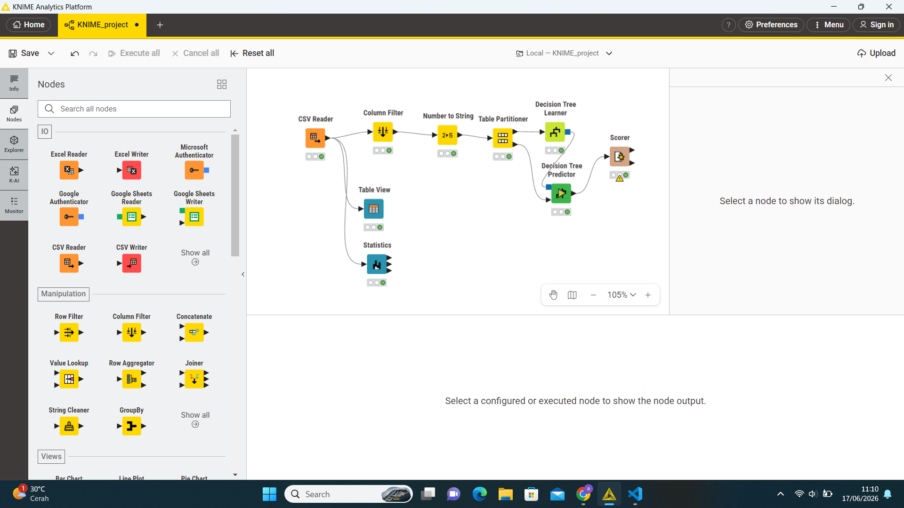
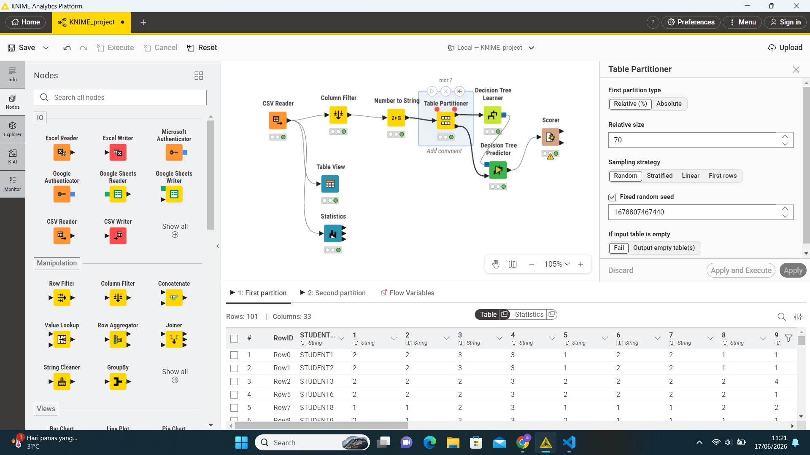
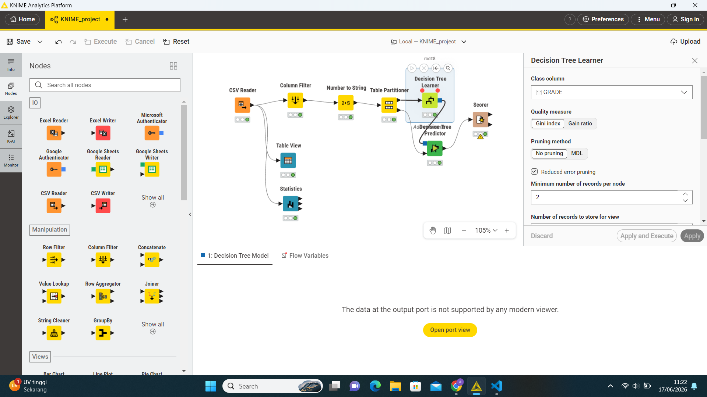
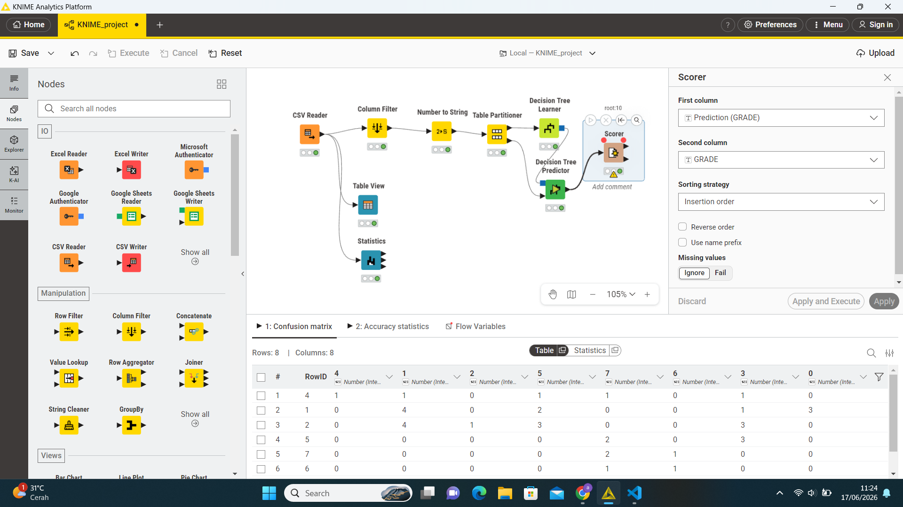

# UAS

## 📊 Ringkasan Proyek

**Tujuan:** Membangun model Decision Tree untuk memprediksi nilai siswa (GRADE)

**Dataset:** 
- Total baris: 145
- Total kolom: 33
- Sumber: File CSV

**Metode:** Machine Learning - Decision Tree Classification

---

## 🔄 Alur Workflow



---

## ⚙️ Detail Konfigurasi Node

### 1. CSV Reader
**Fungsi:** Membaca data dari file CSV

**Output:**
- Rows: 145
- Columns: 33

---

### 2. Column Filter
**Fungsi:** Memilih kolom yang relevan untuk analisis

**Konfigurasi:**
- **Mode:** Manual
- **Includes:**
  - STUDENT ID
  - Kolom 1, 2, 3, 4, 5, 6, 7, 8, dst.

**Hasil:**
```
Rows: 145 | Columns: 33
```

---

### 3. Number to String
**Fungsi:** Mengubah tipe data numerik menjadi string

**Konfigurasi:**
- **Mode:** Manual
- **Kolom yang dikonversi:** 1, 2, 3, 4, 5, 6, 7, 8, 9, dst.<br>
Mengubah angka menjadi kategori nominal (misal: skala Likert) agar Decision Tree memperlakukannya sebagai kategori, bukan nilai kontinu.
 

---

### 4. Table Partitioner
**Fungsi:** Membagi data menjadi training dan data testing

**Konfigurasi:**
| Parameter | Nilai |
|-----------|-------|
| **Relative size** | 70% |
| **Sampling strategy** | Random |
| **Fixed random seed** | 1678807467440 |

**Pembagian Data:**
- **Training set:** 70% (untuk Decision Tree Learner)
- **Testing set:** 30% (untuk Decision Tree Predictor)


---

### 5. Decision Tree Learner
**Fungsi:** Melatih model Decision Tree

**Konfigurasi:**
| Parameter | Nilai |
|-----------|-------|
| **Class column** | GRADE |
| **Quality measure** | Gini index |
| **Pruning method** | No pruning / MDL |
| **Reduced error pruning** | ✓ (Checked) |
| **Minimum records per node** | 2 |

**Output:** Model Decision Tree (port biru)

---

### 6. Decision Tree Predictor
**Fungsi:** Melakukan prediksi pada data testing

**Konfigurasi:**
| Parameter | Nilai |
|-----------|-------|
| **Number of patterns for hilting** | 10000 |
| **Change prediction column name** | ☐ (Unchecked) |
| **Append normalized class distribution** | ☐ (Unchecked) |

**Input:**
1. Model dari Decision Tree Learner
2. Data testing (30%) dari Table Partitioner

**Output:**
```
Rows: 44 | Columns: 34
```

---

### 7. Scorer
**Fungsi:** Mengevaluasi akurasi model

**Input:**
- Nilai GRADE asli (dari data testing)
- Nilai GRADE hasil prediksi
**Output:** Metrik evaluasi (Accuracy, Precision, Recall, F-Measure)

---
Berikut adalah lanjutan laporan untuk node Table View dan Statistics:

---

### 8. Table View
**Fungsi:** Menampilkan preview data mentah untuk inspeksi visual

**Konfigurasi:**
| Parameter | Nilai |
|-----------|-------|
| **Displayed columns** | Manual |
| **Includes** | STUDENT ID, 1, 2, 3, 4, 5, 6, dst. |

**Output Data:**
.png>)

**Tipe Data:**
- STUDENT_ID: **String**
- Kolom 1-9: **Number (Integer)**

**Tujuan:** 
- Memverifikasi data yang terbaca dari CSV
- Memeriksa struktur dan tipe data
- Identifikasi awal pola atau anomali data

---

### 9. Statistics
**Fungsi:** Menghasilkan statistik deskriptif untuk analisis eksploratori data (EDA)

**Konfigurasi:**
| Parameter | Nilai |
|-----------|-------|
| **Calculate median values** | ☐ Unchecked (computationally expensive) |
| **Column filter** | Manual |
| **Includes** | STUDENT ID, 1, 2, 3, 4, dst. |

**Output:**
.png>)

