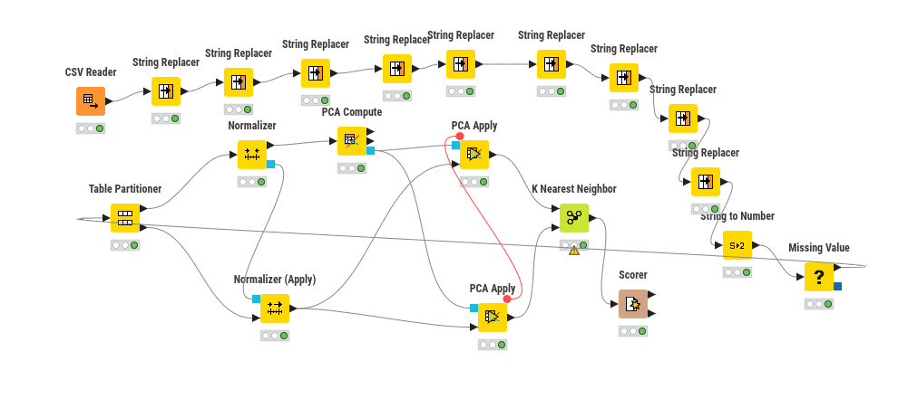

# UTS 

### 1.Persiapan Lingkungan & import library

```python
    import pandas as pd
    import numpy as np
    from sklearn.model_selection import train_test_split, cross_val_score
    from sklearn.preprocessing import StandardScaler, LabelEncoder
    from sklearn.impute import SimpleImputer
    from sklearn.neighbors import KNeighborsClassifier
    from sklearn.metrics import accuracy_score, precision_score, recall_score, f1_score, classification_report

    df = pd.read_csv('kesuburan_tanah.csv')
```
### 2. Eksplorasi Data Awal

```python
    python
    # Cek informasi dasar
    print(df.info())
    print(df.describe())
    print(df['Label'].value_counts())  # Cek distribusi kelas

    # Cek missing values
    print(df.isnull().sum())

    # Cek unik nilai fitur kategorikal
    print(df['Tekstur Tanah'].unique())
```
### 3. Pemrosesan Data(Data Preprocessing)

 ## A. Handle Mising Values
```python
    # Imputasi missing values dengan median (untuk numerik)
        numeric_cols = df.select_dtypes(include=[np.number]).columns
        imputer_num = SimpleImputer(strategy='median')
        df[numeric_cols] = imputer_num.fit_transform(df[numeric_cols])

    # Imputasi untuk kategorikal dengan modus
        if 'Tekstur Tanah' in df.columns:
            imputer_cat = SimpleImputer(strategy='most_frequent')
            df['Tekstur Tanah'] = imputer_cat.fit_transform(df[['Tekstur Tanah']]).ravel()
```
 ## B. Encoding Fitur Kategorikal

```python
    # Encode label target
        label_encoder = LabelEncoder()
        df['Label'] = label_encoder.fit_transform(df['Label'])  # Subur=1, Tidak Subur=0

        # Encode fitur 'Tekstur Tanah' (one-hot encoding lebih disarankan)
        df = pd.get_dummies(df, columns=['Tekstur Tanah'], drop_first=True)
```

 ## C. Pisahkan Fitur dan Target 

 ```python 
        X = df.drop('Label', axis=1)
        y = df['Label']
```

 ## D. Feature Scalling

 ```python
    scaler = StandardScaler()
    X_scaled = scaler.fit_transform(X)
```
### 4. Split Data Training & Testing

```python
    X_train, X_test, y_train, y_test = train_test_split(
    X_scaled, y,
    test_size=0.2,
    random_state=42,
    stratify=y  # Pertahankan distribusi kelas
)
```

### 5. Implementasi KNN

```python
    X_train, X_test, y_train, y_test = train_test_split(
    X_scaled, y,
    test_size=0.2,
    random_state=42,
    stratify=y  # Pertahankan distribusi kelas
)
```

 ## Mencari Nilai K Optimal

 ```python
   # Evaluasi berbagai nilai K
    k_values = range(1, 21)
    cv_scores = []

    for k in k_values:
        knn_temp = KNeighborsClassifier(n_neighbors=k)
        scores = cross_val_score(knn_temp, X_train, y_train, cv=5, scoring='accuracy')
        cv_scores.append(scores.mean())

    # Pilih K dengan accuracy tertinggi
    optimal_k = k_values[np.argmax(cv_scores)]
    print(f"Nilai K optimal: {optimal_k}")
```

 ### 6. Hitung Metrik Evaluasi
```py
    # Hitung metrik
    accuracy = accuracy_score(y_test, y_pred)
    precision = precision_score(y_test, y_pred)
    recall = recall_score(y_test, y_pred)
    f1 = f1_score(y_test, y_pred)

    # Tampilkan hasil
    print(f"Accuracy : {accuracy:.4f} ({accuracy*100:.2f}%)")
    print(f"Precision: {precision:.4f} ({precision*100:.2f}%)")
    print(f"Recall   : {recall:.4f} ({recall*100:.2f}%)")
    print(f"F1-Score : {f1:.4f} ({f1*100:.2f}%)")

    # Laporan lengkap
    print("\nClassification Report:")
    print(classification_report(y_test, y_pred, target_names=['Tidak Subur', 'Subur']))
```

### Gambar Knime :



### Penjelasan Knime :
 ## 1 Input Data
CSV Reader

* Membaca dataset dari file `.csv`

 ## 2 Data Cleaning & Transformasi Awal
String Replacer (beberapa node berurutan)

Digunakan untuk:

* Mengganti nilai teks → nilai numerik
  Contoh:

  * `Subur` → `1`
  * `Tidak Subur` → `0`
* Menghapus spasi, simbol, atau kata yang tidak konsisten
* Menyeragamkan format data kategorikal

 Karena KNN hanya bisa bekerja dengan data numerik, tahap ini wajib.

 ## 3 Konversi Tipe Data
String to Number

* Mengubah kolom bertipe *String* menjadi *Integer / Double*
* Biasanya setelah proses String Replacer selesai

 ## 4. Penanganan Missing Value
Missing Value

* Mengisi data kosong (null)
* Bisa dengan:

  * Mean / Median
  * Nilai konstan
  * KNN Imputation (tergantung setting)

 ## 5. Pembagian Data
Table Partitioner

* Membagi data menjadi:

  * Training data (80%)
  * Testing data (20%)

 ## 6. Normalisasi Data
Normalizer

* Digunakan pada data training
* Contoh metode:

  * Min–Max
  * Z-Score
* Supaya semua fitur berada pada skala yang sama
Normalizer (Apply)

* Menerapkan parameter normalisasi dari data training ke data testing

## 7. Reduksi Dimensi
PCA Compute

* Menghitung komponen utama (Principal Component)
* Mengurangi jumlah fitur
* Menghilangkan korelasi antar fitur
PCA Apply (2 node)

* PCA Apply atas → untuk training data
* PCA Apply bawah → untuk testing data
* Menggunakan hasil PCA Compute yang sama

 Garis merah di gambar menandakan koneksi model PCA

 ## 8. Model Klasifikasi
K Nearest Neighbor

* Model klasifikasi berbasis jarak
* Menggunakan data hasil:

  * Normalisasi
  * PCA
* Parameter umum:

  * K (jumlah tetangga)
  * Distance metric (Euclidean, dll)

## 9. Evaluasi Model
Scorer

* Membandingkan:

  * Label asli
  * Hasil prediksi KNN
* Menghasilkan metrik:

  * Accuracy
  * Precision
  * Recall
  * Confusion Matrix


